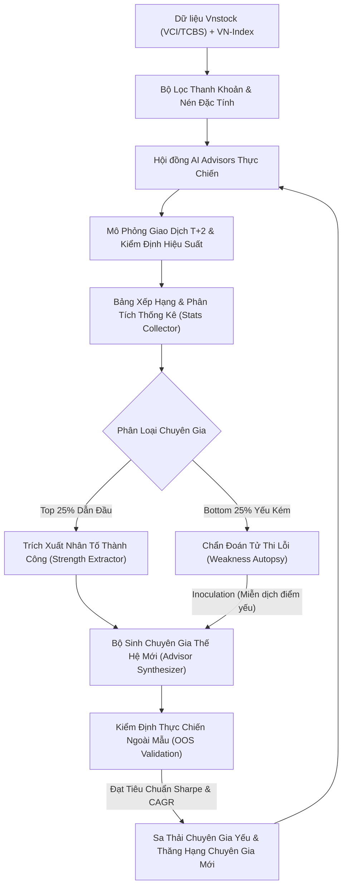

# VN-Stock AI Advisors - Hệ Thống Chuyên Gia AI Thực Chiến & Tiến Hóa Tự Động
## Dự án Độc lập Phân tích Định lượng & Quản lý Danh mục Chứng khoán Thực Chiến (AlphaQuant AI Framework)

Dự án này là hệ thống phân tích định lượng và cố vấn danh mục chứng khoán thực chiến độc lập, phát triển trên nền tảng dữ liệu chứng khoán mã nguồn mở **Vnstock** kết hợp cơ chế kiểm soát rủi ro thị trường Việt Nam (chu kỳ thanh toán T+2, biên độ giá trần/sàn HOSE $\pm 7\%$, lô chẵn 100 cổ phiếu, chi phí thuế phí giao dịch).

Hệ thống sở hữu năng lực **tự tiến hóa liên tục (Continuous Self-Evolution)**: tự động chẩn đoán điểm yếu của các chuyên gia tư vấn yếu kém, giải mã đặc tính thành công của các chuyên gia hàng đầu, từ đó lai ghép di truyền (Genetic Crossover & Inoculation) để tạo ra các chuyên gia AI thế hệ mới thay thế.

---

## 1. Triết Lý Thiết Kế & 3 Nhóm Khách Hàng Mục Tiêu

Hệ thống quy đổi bài toán tư vấn và Copy Trading thành bài toán định lượng: **Lựa chọn Top 5 cổ phiếu tiềm năng nhất** theo từng chu kỳ tái cấu trúc nhằm đảm bảo cân bằng tối ưu giữa khả năng giải ngân, kiểm soát trượt giá (slippage) và đa dạng hóa loại trừ rủi ro phi hệ thống.

| Tiêu chí | Chiến lược Chủ Động | Chiến lược Nhịp Nhàng | Chiến lược Bền Bỉ |
| :--- | :---: | :---: | :---: |
| **Nhóm khách hàng** | **Táo bạo** (Chấp nhận biến động) | **Cân bằng** (Lợi nhuận đi kèm kiểm soát) | **Thận trọng** / NAV Lớn / Tổ chức |
| **Chu kỳ tái cấu trúc** | **2 tuần / lần** (10 ngày GD) | **1 tháng / lần** (21 ngày GD) | **3 tháng / lần** (63 ngày GD / Quý) |
| **Mục tiêu chính** | Tối đa hóa Alpha ngắn hạn | Cân bằng Động lượng & Xu hướng | Bảo toàn vốn & Giảm thiểu sụt giảm |
| **Phương pháp phân bổ**| **Rank Ladder** (Bậc thang tỷ trọng) | **Equal Weight** (Tỷ trọng đều 20%) | **Risk Parity** (Nghịch đảo biến động)|
| **Vòng quay vốn ước tính**| $\sim 35$ vòng / năm | $\sim 19$ vòng / năm | $\sim 6.4$ vòng / năm |
| **Chi phí giao dịch ước tính**| $\sim 2.9\%$ / năm | $\sim 1.5\%$ / năm | $\sim 0.5\%$ / năm |

---

## 2. Giải Pháp Cho 4 Thách Thức Kỹ Thuật Định Lượng

Dự án giải quyết triệt để 4 thách thức định lượng cốt lõi được nêu trong tài liệu nghiên cứu:

1. **Rào cản Thanh khoản (Point-in-Time Liquidity Filter):**
   - Loại trừ hoàn toàn rủi ro bẫy thanh khoản và trượt giá bằng cách tính toán thanh khoản trung bình 20 ngày trailing tại ngày $T-1$.
   - Tối ưu hóa rổ cổ phiếu xem xét $N \in [20, 100]$ mã có giá trị giao dịch lớn nhất thị trường.
2. **Nén Đặc tính & Mất Cân Bằng Dữ Liệu (~600 Features):**
   - Nén dữ liệu thô thành bộ chỉ số đa tầng: Động lượng (RSI, ROC, MACD), Xu hướng (SMA20/50/200, Bullish Alignment), Khối lượng & Dòng tiền (Volume Surge, OBV Trend), Biến động (Bollinger Bands, ATR, Historical Volatility), và Sức mạnh giá tương đối (RS Rating vs VN-Index).
3. **Chống Rò Rỉ Dữ Liệu Tương Lai (Strict 3-Phase Chronological Split):**
   - **Tập Huấn luyện [Train]:** Nhận diện quy luật lịch sử và thiết lập bộ trọng số nhân tố.
   - **Tập Kiểm định [Validation]:** Tinh chỉnh siêu tham số, xếp hạng giải đấu (League Standings).
   - **Tập Thực chiến Ngoài mẫu [Out-of-Sample]:** Kiểm thử mù hoàn toàn (Blind Forward-Testing) trước khi đưa chuyên gia vào vận hành thực tế.
4. **Biến Động Thị Trường & Tự Tiến Hóa (Concept Drift & Darwinian Evolution):**
   - Thay vì phụ thuộc vào một mô hình tĩnh duy nhất, hệ thống vận hành một **Hội đồng Chuyên gia AI** liên tục so tài.
   - Các chuyên gia không thích nghi được với chu kỳ thị trường mới sẽ bị đào thải và thay thế bởi thế hệ kế cận.

---

## 3. Cơ Chế Chẩn Đoán Điểm Yếu & Tiến Hóa Chuyên Gia AI



### Quy trình Chẩn đoán & Lai ghép:
- **Chẩn đoán tử thi (Weakness Autopsy):**
  - *Sụt giảm sâu (MDD > 22%):* Giảm tỷ trọng bắt đáy mean-reversion, tăng hệ số phòng thủ Low Volatility.
  - *Bào mòn chi phí (Turnover > 25x, Phí > 2.5%):* Tự động giãn chu kỳ tái cấu trúc sang 1M hoặc 3M.
  - *Tỷ lệ thắng thấp (Win Rate < 45%):* Bổ sung bộ lọc sức mạnh giá tương đối RS Rating > 75.
- **Lai ghép di truyền (Genetic Crossover):**
  - Kết hợp bộ gene tốt nhất từ 2 chuyên gia đứng đầu bảng xếp hạng.
  - Miễn dịch với các lỗi hệ thống của chuyên gia đội sổ.
  - Đột biến ngẫu nhiên có kiểm soát ($\text{mutation rate} = 15\%$) để mở rộng không gian tìm kiếm Alpha.
- **Thử thách thực chiến (OOS Gatekeeper):**
  - Chuyên gia mới phải chứng minh chỉ số Sharpe và tăng trưởng vượt trội trên dữ liệu ngoài mẫu mới được chính thức thay thế chuyên gia bị sa thải.

---

## 4. Cấu Trúc Mã Nguồn

```
vn-stock-ai-advisors/
├── config/
│   ├── settings.py             # Cấu hình chu kỳ, vốn ban đầu, rổ thanh khoản, thư mục lưu trữ
│   └── trading_rules.py        # Luật thị trường VN: T+2, biên độ giá trần/sàn, lô 100, thuế phí
├── data/
│   ├── vnstock_client.py       # Tích hợp VnStock, giải pháp Truststore SSL doanh nghiệp & bộ đệm Cache
│   ├── universe.py             # Bộ lọc thanh khoản Point-in-Time (Top 20-50 mã lớn nhất HOSE)
│   ├── indicators.py           # Nén ~600 đặc tính định lượng (Momentum, Trend, Volatility, Flow, RS)
│   └── sample_splitter.py      # Phân tách 3 tập dữ liệu nghiêm ngặt (Train, Val, Out-of-Sample)
├── portfolio/
│   ├── allocation.py           # Phân bổ tỷ trọng: Equal Weight, Risk Parity, Rank Ladder
│   ├── position_tracker.py     # Quản lý danh mục, số dư tiền mặt, khóa thanh toán T+2, theo dõi NAV
│   └── risk_manager.py         # Cắt lỗ tự động (-7%), chốt lời trailing stop, bảo vệ khi VN-Index gãy MA50
├── engine/
│   ├── backtest_engine.py      # Mô phỏng khớp lệnh thực tế, phí giao dịch, trượt giá, cơ cấu Top 5
│   ├── performance_metrics.py  # Tính toán CAGR, Alpha vs VN-Index, Beta, Max Drawdown, Sharpe, Sortino
│   └── stats_collector.py      # Thu thập thống kê giải đấu, tính điểm chất lượng, xếp hạng chuyên gia
├── advisors/
│   ├── base_advisor.py         # Lớp cơ sở Chuyên gia AI với bộ gene trọng số định lượng
│   ├── active_advisor.py       # Chiến lược Chủ Động (2W, Rank Ladder, khách hàng Táo bạo)
│   ├── harmony_advisor.py      # Chiến lược Nhịp Nhàng (1M, Equal Weight, khách hàng Cân bằng)
│   ├── persistent_advisor.py   # Chiến lược Bền Bỉ (3M, Risk Parity, khách hàng Thận trọng)
│   ├── canslim_advisor.py      # Chuyên gia Dòng Tiền & Bùng Nổ Khối Lượng CANSLIM/VSA
│   ├── mean_reversion_advisor.py # Chuyên gia Đảo Chiều Thống Kê (RSI oversold)
│   └── dynamic_advisor.py      # Chuyên gia Tiến Hóa Thế Hệ Mới (được sinh ra tự động)
├── evolution/
│   ├── weakness_analyzer.py    # Khám nghiệm điểm yếu & nguyên nhân thua lỗ
│   ├── strength_extractor.py   # Bóc tách nhân tố sinh lời của chuyên gia dẫn đầu
│   ├── advisor_synthesizer.py  # Lai ghép di truyền & tạo chuyên gia thế hệ mới
│   └── lifecycle_manager.py    # Quản lý vòng đời, sa thải chuyên gia yếu & thăng hạng
├── reports/
│   ├── visualizer.py           # Bảng điều khiển Terminal Rich & Vẽ biểu đồ đường cong NAV
│   └── generator.py            # Xuất báo cáo Markdown và dữ liệu JSON cho ban điều hành
├── main.py                     # CLI điều hành toàn bộ quy trình
└── requirements.txt            # Danh sách thư viện phụ thuộc
```

---

## 5. Hướng Dẫn Cài Đặt & Sử Dụng

### 5.1. Cài đặt môi trường

```bash
cd vn-stock-ai-advisors
pip install -r requirements.txt
```

### 5.2. Chạy toàn bộ chu trình (Mô phỏng, Đánh giá & Tiến hóa)

```bash
# Chạy ở chế độ FAST (Khuyến nghị: Rổ 15 mã bluechips đại diện thanh khoản cao nhất)
python main.py run-all

# Chạy ở chế độ FULL (Quét toàn bộ 45+ mã cổ phiếu cơ sở trên thị trường)
python main.py run-all --full
```

### 5.3. Xem khuyến nghị Top 5 danh mục hôm nay (Copy Trading)

```bash
python main.py live-advise
```

### 5.4. Kiểm tra kết nối dữ liệu Vnstock

```bash
python main.py test-data
```

---

## 6. Kết Quả Báo Cáo Đầu Ra

Sau khi chạy lệnh `python main.py run-all`, hệ thống tự động xuất các báo cáo chuyên sâu tại thư mục `reports/output/`:
1. `Bao_Cao_Chuyen_Gia_AI.md`: Báo cáo chi tiết bảng xếp hạng, phân tích từng chiến lược theo tệp khách hàng, và nhật ký chẩn đoán tử thi - tiến hóa chuyên gia.
2. `summary_metrics.json`: Dữ liệu số liệu thô phục vụ tích hợp API với hệ thống Copy Trading và Mobile App.
3. `equity_curve_comparison.png`: Biểu đồ tăng trưởng tài sản (NAV) so sánh trực quan giữa các Chuyên gia AI và chỉ số VN-Index.
