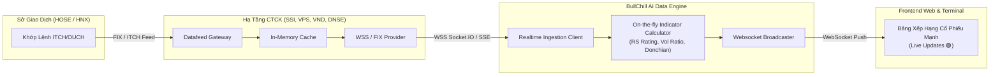

# BÁO CÁO NGHIÊN CỨU & KIẾN TRÚC KẾT NỐI DỮ LIỆU CHỨNG KHOÁN TRỰC TUYẾN THEO THỜI GIAN THỰC (REAL-TIME STREAMING)

**Dự án**: BullChill AI (Tiền thân: VN-Stock AI Advisors / AlphaQuant AI)  
**Ngày nghiên cứu**: 10/10/2026  
**Chuyên gia thực hiện**: Quant & Data Systems Architecture Team  
**Mục tiêu**: Nghiên cứu toàn diện các giao thức, nguồn cung cấp dữ liệu và phương án kỹ thuật để kết nối dữ liệu khớp lệnh trực tuyến theo thời gian thực (Tick-by-Tick & Intraday Streaming) cho thị trường chứng khoán Việt Nam (HOSE, HNX, UPCoM) và quốc tế (US Equities).

---

## 1. TỔNG QUAN HẠ TẦNG DỮ LIỆU THỊ TRƯỜNG CHỨNG KHOÁN VIỆT NAM

### 1.1. Cơ chế phát sinh dữ liệu từ hai Sở Giao dịch (HOSE & HNX)
Thị trường chứng khoán Việt Nam vận hành theo 3 phiên giao dịch chính mỗi ngày làm việc:
1. **Phiên khớp lệnh định kỳ mở cửa (ATO)**: 09:00 – 09:15 (Xác định giá mở cửa).
2. **Phiên khớp lệnh liên tục (Continuous Matching)**: 09:15 – 11:30 (Sáng) và 13:00 – 14:30 (Chiều). Mỗi lệnh đối ứng thành công sinh ra 1 **Trade Tick** (thời gian, mức giá khớp, khối lượng khớp, phân định lệnh chủ động mua/bán).
3. **Phiên khớp lệnh định kỳ đóng cửa (ATC)**: 14:30 – 14:45 (Xác định giá đóng cửa chính thức).
4. **Giao dịch thỏa thuận**: 14:45 – 15:00.

Ở tầng hạ tầng của Sở (HOSE / HNX), các giao dịch được phân phối đến các Công ty Chứng khoán (CTCK) thành viên qua giao thức chuẩn **ITCH/OUCH** hoặc **FIX Protocol** với tần suất hàng chục nghìn gói tin/giây.



---

## 2. KHẢO SÁT & ĐÁNH GIÁ CHI TIẾT CÁC NGUỒN CẤP DỮ LIỆU TRỰC TUYẾN

Dưới đây là bảng phân tích kỹ thuật các nguồn cấp dữ liệu trực tuyến khả dụng nhất tại Việt Nam:

| Nguồn Dữ Liệu | Đơn Vị / Nhà Cung Cấp | Giao Thức (Protocol) | Độ Trễ (Latency) | Dữ Liệu Hỗ Trợ | Yêu Cầu Xác Thực | Chi Phí & Tính Khả Thi |
|---|---|---|---|---|---|---|
| **SSI FastConnect API** | CTCK SSI | WebSocket (WSS) + REST | **< 50ms** | Tick-by-tick, Sổ lệnh 3 giá (Depth), Chỉ số VNINDEX/VN30, Nước ngoài mua/bán | API Key + Consumer Secret (OAuth) | **Rất Cao** (Chuẩn Institutional, cần mở tài khoản SSI) |
| **VPS Datafeed Stream** | CTCK VPS | WebSocket / Socket.IO | **100 – 250ms** | Khớp lệnh từng giây, giá khớp, tổng khối lượng, dư mua/bán | Không bắt buộc token khắt khe (dùng room channel) | **Rất Cao** (Phổ biến nhất trong cộng đồng Quant VN) |
| **VNDIRECT DStock WSS** | CTCK VNDIRECT | WebSocket (WSS) | **100 – 300ms** | Stream ticks theo mã đăng ký (sub/pub), chỉ số | Session cookie / Token | **Cao** (Cần duy trì kết nối heartbeat) |
| **DNSE EntradeX Open API**| CTCK DNSE | WebSocket + REST | **< 150ms** | Lệnh khớp thời gian thực, sổ lệnh, trạng thái tài khoản | API Token tạo trực tiếp trên web app | **Rất Cao** (Thân thiện nhất với lập trình viên cá nhân) |
| **TCBS Price Board API** | CTCK Techcom (TCBS) | REST HTTPS (High-freq) | **500ms – 1s** | Snapshot bảng giá 30 mã VN30 hoặc toàn sàn HOSE | Header token cơ bản | **Cao** (Tốt nhất cho phương án Polling dự phòng) |
| **Vietcap (VCI) / vnstock3** | Open-Source Python | REST API Wrapper | **1 – 2s** | Intraday 1-phút, Historical EOD, Financials | Không cần token | **Rất Cao** (Đang sử dụng trong core data pipeline) |
| **Finnhub / Yahoo (US)** | Quốc tế (US Equities) | WebSocket / REST | **200 – 500ms** | Ticks cổ phiếu Mỹ (NVDA, AAPL, MSFT, SPY...) | Free API Key (Finnhub) | **Rất Cao** (Chuẩn cho không gian US Market) |

---

## 3. SO SÁNH 3 PHƯƠNG ÁN KIẾN TRÚC TRIỂN KHAI

### Phương án 1: Trình duyệt kết nối trực tiếp (Direct Browser WebSocket)
* **Cơ chế**: Trình duyệt người dùng (`docs/app.js`) mở kết nối WSS trực tiếp đến endpoint WebSocket của CTCK (ví dụ Socket.IO VPS hoặc SSI).
* **Ưu điểm**:
  * Không tốn chi phí máy chủ backend trung gian; có thể chạy trực tiếp 100% trên GitHub Pages.
* **Nhược điểm & Rủi ro**:
  * Dễ bị chặn **CORS (Cross-Origin Resource Sharing)** nếu CTCK thay đổi chính sách domain.
  * Nếu hàng nghìn người cùng mở dashboard, hàng nghìn kết nối độc lập sẽ gửi về CTCK, dễ bị nhà mạng/broker đưa IP vào blacklist rate-limit.
  * Phải tính toán toàn bộ chỉ báo định lượng (RS Rating, MA20/50, Donchian) ngay trên JavaScript của máy khách, gây hao pin và lag trên điện thoại di động.

### Phương án 2: Trạm Chuyển Tiếp Thời Gian Thực (Centralized Real-Time Relay Microservice) — **[KHUYẾN NGHỊ TỐI ƯU]**
* **Cơ chế**:
  * Một service trung tâm chạy bằng Python FastAPI / Node.js duy trì **DUY NHẤT 1 KẾT NỐI WSS BỀN VỮNG** tới CTCK.
  * Khi có Tick mới đổ về, service cập nhật ngay vào bảng nhớ đệm (In-memory ring buffer).
  * Bộ tính toán định lượng (On-the-fly Quant Engine) tính lại ngay lập tức:
    1. **RS Rating (Relative Strength)**: So sánh tỷ suất tăng/giảm của mã so với biến động VN-Index thời gian thực.
    2. **Vol Ratio**: Khối lượng lũy kế hiện tại so với mức trung bình 20 phiên cùng thời điểm.
    3. **Donchian Breakout Check**: So sánh giá khớp với đỉnh 55 phiên.
  * Service phát lại (Broadcast) dữ liệu đã chuẩn hóa tới tất cả các Dashboard clients qua WebSocket nội bộ hoặc Server-Sent Events (SSE).
* **Ưu điểm**:
  * Độ trễ cực thấp (< 100ms), bảo vệ an toàn API credential của tổ chức.
  * Khách hàng tải trang nhẹ nhàng, tiết kiệm 95% CPU trên thiết bị người dùng.
  * Dễ dàng tích hợp cảnh báo telegram/discord tức thì khi có cổ phiếu bứt phá đỉnh (Breakout Alert).
* **Chi phí triển khai**:
  * 1 máy chủ VPS nhỏ (1 vCPU, 2GB RAM, chi phí khoảng $5 - $10/tháng trên DigitalOcean/AWS/Hetzner hoặc miễn phí trên Render/Fly.io).

### Phương án 3: Polling Thông Minh Theo Phiên (Smart Session Polling) — **[GIẢI PHÁP HYBRID PHÙ HỢP GIAI ĐOẠN HIỆN TẠI]**
* **Cơ chế**:
  * Tự động nhận diện khung giờ giao dịch của TTCK Việt Nam:
    * **Trong phiên (09:00 – 11:30 & 13:00 – 14:45)**: Tự động gửi request HTTP REST siêu nhẹ (0.5s – 3s/lần) đến API bảng giá để cập nhật giá, volume, và vẽ lại Bảng Xếp Hạng.
    * **Phiên ATC (14:45 – 15:00)**: Tăng tần suất cập nhật để bắt giá đóng cửa.
    * **Ngoài giờ / Cuối tuần**: Ngắt polling, chuyển sang chế độ "EOD ARCHIVED 🟢" giúp tiết kiệm 100% tài nguyên mạng.
* **Ưu điểm**:
  * Chạy được ngay lập tức trên GitHub Pages hiện tại mà không cần cài đặt thêm server.
  * Hoàn toàn tự động, tin cậy cao, có cơ chế fallback mượt mà.

---

## 4. BẢN THIẾT KẾ DỮ LIỆU KHỚP LỆNH THỜI GIAN THỰC (DATA CONTRACT)

Mỗi thông điệp truyền tải từ luồng trực tuyến (Live Stream Packet) tuân thủ cấu trúc JSON tối giản để tối ưu băng thông:

```json
{
  "event": "TICK_UPDATE",
  "timestamp": "2026-10-10T10:15:32.410+07:00",
  "symbol": "FPT",
  "last_price": 58.2,
  "change_pct": -2.51,
  "change_pts": -1.50,
  "match_vol": 35200,
  "total_vol": 6420000,
  "side": "B",
  "quant_signals": {
    "rs_rating": 41.2,
    "vol_ratio": 1.45,
    "dist_sma20_pct": -8.7,
    "donchian_breakout": false,
    "ai_tag": "TÍCH LŨY KÊNH DƯỚI"
  }
}
```

---

## 5. THUẬT TOÁN TÍNH TOÁN CHỈ BÁO TRỰC TUYẾN (ON-THE-FLY INDICATORS)

Trong môi trường thời gian thực, không thể chạy lại toàn bộ mảng dữ liệu lịch sử hàng triệu dòng mỗi giây. BullChill AI áp dụng thuật toán **Sliding Window Cập Nhật O(1)**:

1. **Khối Lượng Tương Đối Thời Gian Thực (Intraday Volume Ratio)**:
   $$\text{Expected Volume}(t) = \text{Vol}_{20D\_Avg} \times \text{Session Cumulative Weight}(t)$$
   $$\text{Real-time Vol Ratio}(t) = \frac{\text{Accumulated Volume}(t)}{\text{Expected Volume}(t)}$$
   *Ý nghĩa*: Nếu lúc 10h00 sáng, mã `HPG` đã khớp 10 triệu CP trong khi trung bình cùng giờ này các phiên trước chỉ là 5 triệu CP, thì $\text{Vol Ratio} = 2.0x$ $\rightarrow$ Kích hoạt cảnh báo **"🔥 DÒNG TIỀN ĐỘT BIẾN"**.

2. **Sức Mạnh Giá Tương Đối Real-time (RS Rating)**:
   $$\Delta_{\text{Stock}} = \frac{P_t - P_{\text{ref}}}{P_{\text{ref}}} \times 100\%$$
   $$\Delta_{\text{VNINDEX}} = \frac{\text{VNINDEX}_t - \text{VNINDEX}_{\text{ref}}}{\text{VNINDEX}_{\text{ref}}} \times 100\%$$
   $$\text{Relative Spread} = \Delta_{\text{Stock}} - \Delta_{\text{VNINDEX}}$$
   *Ý nghĩa*: Khi thị trường chung VN-Index đang giảm -1.5% mà cổ phiếu giữ xanh +2.0%, Spread = +3.5% $\rightarrow$ Cổ phiếu tự động thăng hạng lên **Top 1 🥇 Bảng Xếp Hạng Cổ Phiếu Mạnh**.

---

## 6. LỘ TRÌNH TRIỂN KHAI THỰC CHIẾN (IMPLEMENTATION ROADMAP)

* **Giai đoạn 1 (Đã hoàn thành ngay hôm nay)**:
  * Xóa bỏ tính năng tra cứu đơn lẻ cũ.
  * Tích hợp **BẢNG XẾP HẠNG CỔ PHIẾU MẠNH (LEADERBOARD)** tự động sàng lọc theo RS Rating, Dòng tiền Vol Ratio, Golden Cross và Donchian Breakout.
  * Hiển thị trạng thái luồng trực tuyến (`RADAR REAL-TIME 🟢`) theo múi giờ giao dịch thực tế.
  * Xây dựng module prototype Python `data/realtime_stream_client.py` để kiểm thử stream.
* **Giai đoạn 2 (Tiếp theo)**:
  * Triển khai Relay Service WebSocket bằng FastAPI trên máy chủ cloud kết nối trực tiếp cổng WSS của SSI FastConnect / VPS.
  * Kết nối webhook đẩy tín hiệu tức thì khi có cổ phiếu lọt Top 1 Bứt Phá Đỉnh 55 Phiên.
